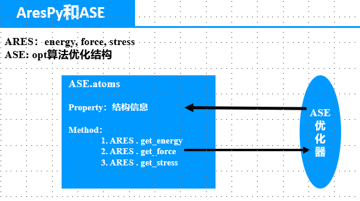
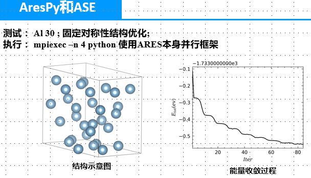

# AresPy 和 ASE

周日和周一两天主要在看师兄推荐的pymatgen,pymatgen里面对material project的数据库访问模块确实特别给力，谢谢师兄!

昨天和今天主要看了ASE，写了一下AresPy的calculator.

## ASE框架

简单说一下我这两天对ASE的理解



ASE为我们搭建了一个结构计算模拟的平台，其ASE.Atoms类可以帮助我们方便得建立结构。

为了计算ASE.Atoms得物理性质如能量等，我们为这个类赋予一个Calculator即可，ASE本身已经集成了许多的Calculator。

当ASE.Atoms有了Calculator时，便可以通过各种优化算法，以减小能量为目标(我猜想，结构更稳定嘛),在满足所给约束的情况下，根据force，stress等信息，调整体系结构的参数(原子坐标和晶格矢量).

现在我的工作仅仅就是写一个基于ARES的calculator,嵌入ASE框架即可

## Calculator

### 从ARES获取信息

- force : 目前看force来自于ARES源程序的一个结构体,直接获取改结构体的结果和ARES自己输出的结果相同
- stress：和force情况相同
- energy: 目前的获取结果和ARES自己输出的结果相同

### 给ARES结构信息

ARES中通过读取poscar获取结构信息，获取后将信息存储于一个结构体中，然后在MPI框架下广播所获得的结构

我写的API完全模仿ARES套路，以ASE的结构信息为参数，直接传入.

### Calculator计算

我写的calculator如下:

- 在初始化cal时初始化ARES环境
- 在获取能量时，执行计算，同时给传出force和stress
- *现在的问题是：*
    - **在ASE优化过程中,cal对象仅初始化一次，当给ARES传入新的结构是，之前计算的电子密度等应该是完全不变,不清楚这样是否可行**
    - **对ASE优化过程中，对cal的使用还是有点模糊**

```python
class aresCalculator(Calculator):
    """Ares calculator for ase"""
    implemented_properties = ['energy', 'forces', 'stress']

    def __init__(self,
                 atoms=None,
                 inputfile=None,
                 input_data=None,
                 structureFile=None,
                 **kwargs):
        Calculator.__init__(self, atoms=atoms, input_data=input_data, **kwargs)
        self.restart()
        self.atoms = atoms
        self.inputfile = inputfile
        self.structureFile = structureFile
        if self.structureFile is not None:
            self.atoms = ase.io.read(self.structureFile, format='vasp')
        self.driver_initialise()

    def driver_initialise(self):
        Ares.Smpi_Math_Module().smpi_init()
        Ares.Read_Module().read_file(self.inputfile)
        Ares.Scalapack_Module().init_scala()
        Ares.Relax_Module().initialize_relax()
        self.aresOut = Ares.Aresmainapi().aresOut()
        Ares.Aresmainapi().init_alloc_arrays(self.aresOut,
                                             Ares.Struct_Module().natom)

    def restart(self):
        self._energy = None
        self._forces = None
        self._stress = None

    def get_potential_energy(self, atoms=None, **kwargs):
        self.atoms = atoms 
        Ares.Aresmainapi().updateions(self.atoms.positions.T,self.atoms.cell)
        Ares.Forcestress_Module().cal_force_stress()
        Ares.Aresmainapi().assignment(self.aresOut)
        self._energy = Ares.Energy_Module().etot * Ares.Constants().hart2ev
        return self._energy

    def get_forces(self, atoms=None):
        self._forces = self.aresOut.forces.T
        return self._forces

    def get_stress(self, atoms=None):
        self._stress = self.aresOut.stress * Ares.Constants().au2gpa
        return self._stress

    def __del__(self):
        Ares.End_Module().destroy_beast()
```

### 测试

我简单做了一个测试，根据ARES的输出，确实可以在多个核上跑起来

```python
atoms = ase.io.read("ares.cell", format='vasp')
print(atoms.cell)
cal = aresCalculator(inputfile="ares.in",atoms=atoms)
atoms.calc = cal
atoms.set_constraint(FixSymmetry(atoms))
opt = LBFGS(atoms, trajectory='opt.traj', use_line_search=False)
opt.run(fmax=0.01)
```

